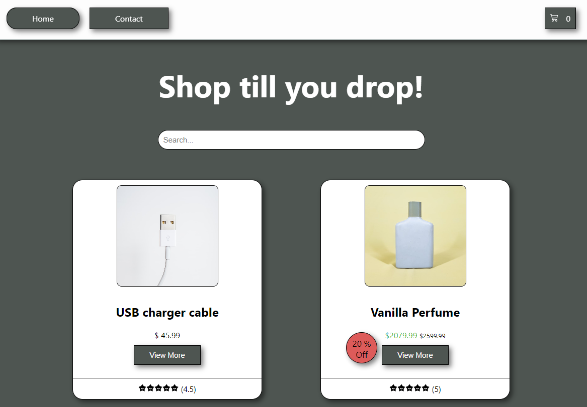

# Ecom Shop



[](https://app.netlify.com/sites/ecomshop1/deploys)

## Description

An eCom shop.

- Homepage with products.
- Look-ahead searchbar on Homepage.
- Clicking on a product takes the user to a specific page for that product.

## Built with

- [React.js](https://react.dev/)
- [CSS Modules](https://github.com/css-modules/css-modules)

## Getting Started

## Installing

1. Clone the Repo:

```md
git clone https://github.com/Littlaa/js-frameworks-react-ca.git
```

2. Install Dependencies:

```md
npm i
```

### Running

To run the app, run the following command:

```md
npm run start
```

#### Contributing

If you want to contribute to this Ecom shop - here are the steps you should follow:

1. Fork the project to your own GitHub profile.
2. Clone the fork on your local machine.
3. Create a branch where you will push your code.
4. Make changes - Comment the changes you do.
5. Push changes to GitHub.
6. Create a pull request for merge.

#### Contact

If you want to contact me, here is my information:

[My LinkedIn page](http://www.linkedin.com/in/mona-dagsland-56ba85226)
